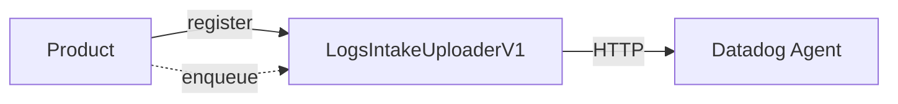
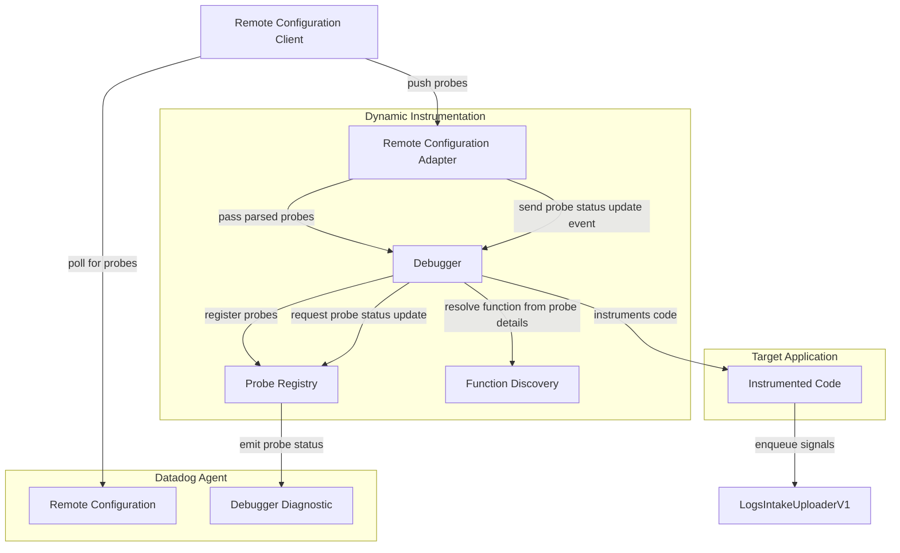
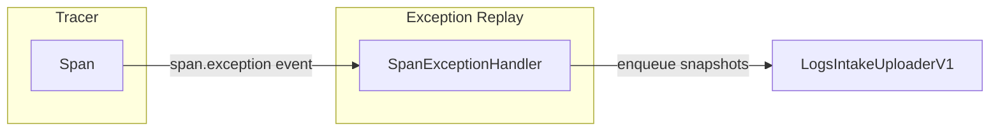
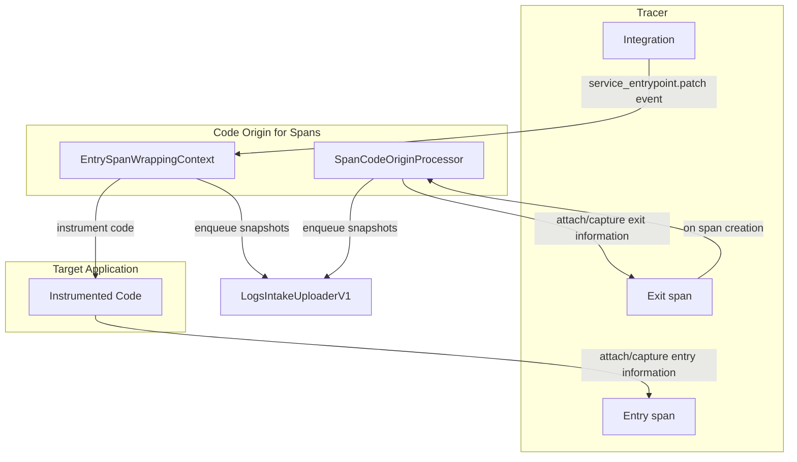

# Datadog Debugging

This area contains the implementation of the following products:

- Dynamic Instrumentation
- Exception Replay
- Code Origin for Spans

## General Architectural Overview

Many of the products listed above need to generate signals, most often in the
form of snapshots. These are special log messages that contain a log messages,
and potentially extra debugging information, such as the value of local
variables, arguments, return value, exceptions, stack traces, etc.

The unit responsible for uploading the generated snapshots is the
`LogsIntakeUploaderV1`. This is a periodic worker thread that monitors a queue
of encoded snapshots that are ready to be uploaded to the logs intake via the
Datadog agent. Products needing to upload snapshots must register with the
`LogsIntakeUploaderV1`. This will ensure that the uploader is started/stopped as
required.

## Dynamic Instrumentation

Dynamic Instrumentation is driven by probe configuration payloads coming from
the Remote Configuration client. All probe types are implemented in the
`ddtrace.debugging._probe.model` sub-module. The general features of probes are
encapsulated in mix-in classes which are then composed together to declare the
concrete probe types. The signals these probes emit are defined in
`ddtrace.debugging._signal`. The base signal class is defined in
`ddtrace.debugging._signal.model`. When a new new probe requires the definition
of a new signal, a new subclass should be created that:

1. implements the `line`, `enter`, `exit` methods as required
2. registers the signal with the probe via `@probe_to_signal.register`

Probe status is reported periodically. To avoid creating an additional thread,
we let the RC signal received by the debugger do the check on whether new probe
status need to be uploaded. These are messages that are enqueued to the
`LogsIntakeUploaderV1` and are uploaded to the Datadog agent.

The following diagram shows the general flow of probe configuration payloads
from the Remote Configuration client to the Dynamic Instrumentation component.

An important aspect of Dynamic Instrumentation is function discovery. We make
use of a sub-class of the `ModuleWatchdog` to intercept all module imports to
create a mapping between module objects and their origin source file path. This
allows us to resolve the source file and line number of line probes to a
function object that we can instrument. Functions are discovered by collecting
the code objects created during the module execution, and then lazily querying
the garbage collector for the corresponding function object. When the code
object is not available, we fall back to inspecting the content of the module
object for any nested function-like objects. In this case, we might fail to
discover functions that have been decorated with arbitrary decorators.

## Exception Replay

The Exception Replay product integrates with the tracer to capture debug
information whenever a span is marked with an error, and a traceback object is
available. For this to work we simply listen for `span.exception` core events
and react accordingly.

## Code Origin for Spans

Code Origin for Spans is a product that allows retrieving code origin
information for exit and entry spans. The implementation for the two types of
span is different.

For **entry** spans, we listen for the `service_entrypoint.patch` core event,
which is emitted every time an integration is about to patch a service
entrypoint from a framework (e.g. Flask). The function object that is used as
the entrypoint is then instrumented with a wrapping context to allow the
extraction of code origin information (pre-computed and cached for performance),
as well as a snapshot, if required.

For **exit** spans, we register a span processor that performs the required work
when a span is created, provided the span kind is one that can be considered an
exit span (e.g. HTTP, DB etc...).

