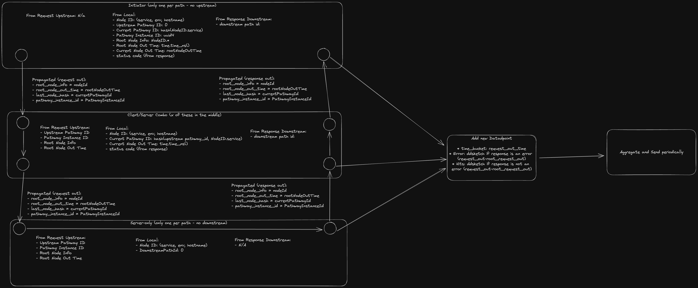

### 10,000 Foot View
At a high-level, AccuPath generates aggregate metrics for requests which follow a specific graph traversal.

Imagine a distributed trace which represents the entry and exit points (server/client calls) for a series of synchronous requests between HTTP servers.
AccuPath takes this distributed trace, gives the pathway of services within the trace a unique ID, and then generates metrics for all traces which follow
that same pathway.

### Glossary

* **path** - A traversal through a set of nodes along a set of edges
* **partial path** - A set of synchronous calls which hasn't yet "ended" (i.e. turned into a response)
* **complete path** - A set of synchronous calls which has "ended" (turned into a response path)
* **upstream pathway hash/id** - Partial request pathway ID including nodes from root to the last node (excludes current node)
* **current pathway hash/id** - Partial request pathway ID including nodes from root to the current node (includes current node)
* **downstream pathway hash/id** - The downstream pathway hash is the child's request pathway hash ID.  Alias: response path whash

### Helpful? image



### On outbound request (HTTP client)
- If there is no upstream pathway header information:
    - `upstream_pathway_hash = 0  # This is specifically for the root of a pathway and is needed to identify a pathway`
    - `current_pathway_id = hash(current_node_info) # Generate and store a new pathway ID`
    - `pathway_instance_id = uuid() # Generate and store a unique instance ID`
    - `root_node_info = current_node_info # Generate and store the current node ID information`
    - `root_node_out_time = current_nanosecond_epoch_timestamp() # Generate and store the current node out time`
    - `current_node_out_time = root_node_out_time  # Used for bucketing metrics and latencies`
- Else:
    - `last_node_pathway_id = extract_from_headers('last_node_pathway_id')`
    - `current_pathway_id = hash(current_node_info, last_node_pathway_id) # Combine the current node info and the pathway id from the last node into the current pathway ID`
    - `pathway_instance_id = extract_from_headers('pathway_instance_id')`
    - `root_node_info = extract_from_headers('root_node_info')`
    - `root_node_out_time = extract_from_headers('root_node_out_time)`
    - `current_node_out_time = current_nanosecond_epoch_timestamp()  # Used for bucketing metrics, not propagated`

Context Injection and Propagation (inject these):
- `x-datadog-accupath-pathway-last-node-hash = current_pathway_id #this node's hash becomes our child's "last" hash`
- `x-datadog-accupath-pathway-uid = pathway_instance_uid`
- `x-datadog-accupath-pathway-root-node-info = root_node_info`
- `x-datadog-accupath-pathway-root-checkpoint-time = root_node_out_time`

Notes:
* Store these values for later, we'll need them to generate sketches and the payload once a response comes back
* names, functions, etc are pseudo-code, use your own judgement
* HTTP server extraction data is combined with HTTP client response data, so we need both to be accessible (i.e. 'B' is both a client and a server in A -> B -> C)

### On inbound request (HTTP server)
- Store and extract header information as necessary, per language rules and with the need to access them later

### On outbound response (HTTP server)
- If there is no downstream response header information:
    - `downstream_response_hash = 0  # This is unique for the last node in a request chain and is needed to identify a pathway`
- Else:
    - `root_node_info = extract_from_headers('root_node_info')`
    - `root_node_out_time = extract_from_headers('root_node_out_time')`
    - `current_pathway_id = we_sent_this_in_the_request_output()`
    - `pathway_uid = extract_from_headers('pathway_uid') # same as request_out`
    - `downstream_response_hash = extract_from_headers('last_node_hash')  # the last response's hash id is now our "last node hash"`

Context Injection and Propagation (inject these):
- `x-datadog-accupath-pathway-uid = pathway_instance_uid # duplicates request header`
- `x-datadog-accupath-pathway-root-node-info = root_node_info # duplicates request header`
- `x-datadog-accupath-pathway-root-checkpoint-time = root_checkpoint_time # duplicates request header`
- `x-datadog-accupath-pathway-last-node-hash = current_node_hash # this is the same information we sent out as part of the request injection`

### On inbound response (HTTP Client)
- Store and extract header information as necessary, per language rules and with the need to access them later

## Telemetry Generation
We generate telemetry when we have the full pathway id `(upstream_hash, downstream_hash, current_node)`, so we have to wait for downstream to reply.

The datapoint tuple (generate per request/response pair) we need to store:
* Time bucket: nanosecond epoch of the time we send out a request
* pathway_id: (upstream_hash, downstream_hash, current_pathway_hash)
* 2xSketches:
    - Hits: ddsketch with seconds from root_node (as passed by headers) (if response was NOT an error)
    - Errors: ddsketch with seconds from root_node (as passed by headers) (if reseponse was an error)

## Telemetry submission
* Every <x> seconds (python uses 10) send all data aggregated in the local sketches and send it to datadog
* Requires an API key


## Other implementation details
* The hashing algorithm used is fnv_1
* The parameters which constitute node ID for pathway id generation is currently limited to "service"
* The node id parameters for all other use-cases (protobuf) are (service, env, hostname)

### On 


### Protobuf Generation
* to regenerate the proto:

```
protoc -I=/Users/accupath/Workspace/experimental/users/ani.saraf/accupath/architectures/services/dd-go/pb/proto/trace/datapaths/ \
    --python_out=/Users/accupath/Workspace/experimental/users/ani.saraf/accupath/architectures/services/dd-trace-py/ddtrace/internal/accupath/ \
    --pyi_out=/Users/accupath/Workspace/experimental/users/ani.saraf/accupath/architectures/services/dd-trace-py/ddtrace/internal/accupath/ \
    /Users/accupath/Workspace/experimental/users/ani.saraf/accupath/architectures/services/dd-go/pb/proto/trace/datapaths/payload.proto
```


### Python Specifics

#### Logging
Create loggers like this to allow toggles:

```
log = get_logger(__name__)

_accupath_processor = processor._processor_singleton

from ddtrace.internal.accupath.checkpoints import _time_checkpoint
from ddtrace.internal.accupath.stats import _checkpoint_diff
```


### TODO and considerations
- Right now everything is specific to services, we should treat this more broadly
- Combine data models with DSM and APM
- Add an environment variable to enable/disable AccuPath
- Efficiency/trimming/length of headers and {un}marshalling
- Expand beyond HTTP
- Expand beyond synchronous linear requests
- Testing -_-
- Span links (future consideration)
- How to handle downstream errors / partial paths
    - How to combine with DSM
- Think through the Core API more carefully
- We can get more accurate processing times.  Right now tracing the middleware on the response path is only the time for our response, not the rest of the middleware
- remove unused code
- Look into implementing the POC in Go
- Performance analysis
- Security is a question, in particular for response pathway injection
- Hostname isn't necessarily known by the tracer; it may have to be added by the agent, which is too late for injection
- We aren't currently using the agent, we'll have to add that in