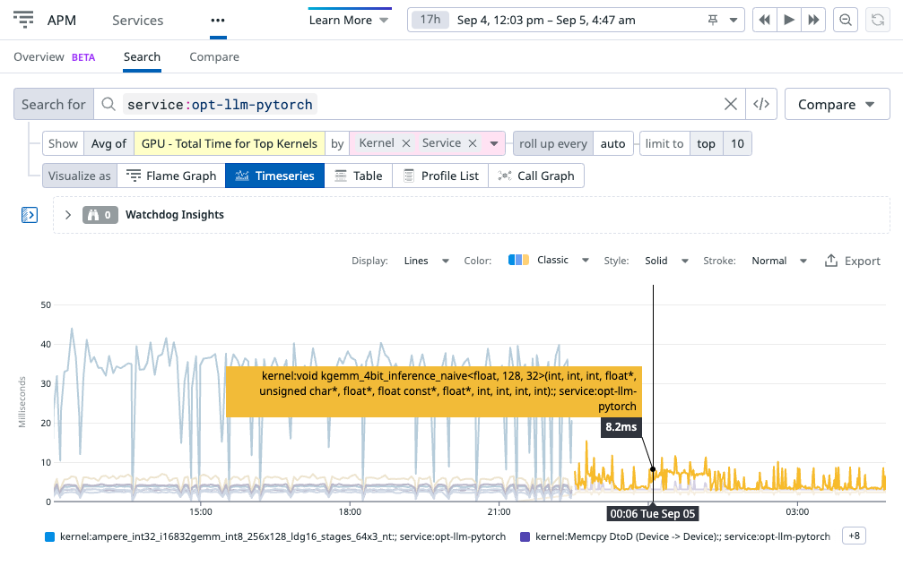

Advanced Usage
==============

.. _context:

Context
-------

The :class:`ddtrace.trace.Context` object is used to represent the state of
a trace at a point in time. This state includes the trace id, active span id,
distributed sampling decision and more. It is used to propagate the trace
across execution boundaries like processes
(:ref:`Distributed Tracing <disttracing>`), threads and tasks.

To retrieve the context of the currently active trace use::

        context = tracer.current_trace_context()

Note that if there is no active trace then ``None`` will be returned.

Tracing Context Management
--------------------------

In ``ddtrace`` "context management" is the management of which
:class:`ddtrace.trace.Span` or :class:`ddtrace.trace.Context` is active in an
execution (thread, task, etc). There can only be one active span or context
per execution at a time.

Context management enables parenting to be done implicitly when creating new
spans by using the active span as the parent of a new span. When an active span
finishes its parent becomes the new active span.

``tracer.trace()`` automatically creates new spans as the child of the active
context::

    # Here no span is active
    assert tracer.current_span() is None

    with tracer.trace("parent") as parent:
        # Here `parent` is active
        assert tracer.current_span() is parent

        with tracer.trace("child") as child:
            # Here `child` is active.
            # `child` automatically inherits from `parent`
            assert tracer.current_span() is child

        # `parent` is active again
        assert tracer.current_span() is parent

    # Here no span is active again
    assert tracer.current_span() is None

.. important::

    Span objects are owned by the execution in which they are created and must
    be finished in the same execution. The span context can be used to continue
    a trace in a different execution by passing it and activating it on the other
    end. Note that in all instances of crossing into another
    execution, sampling should be run manually before entering the new execution
    to ensure that the sampling decision is the same across the trace.
    This can be done using `tracer.sample(tracer.current_root_span())`

    See the sections below for how to propagate traces across task, thread or
    process boundaries.

Tracing Across Threads
^^^^^^^^^^^^^^^^^^^^^^

To continue a trace across threads the context needs to be passed between
threads::

    import threading, time
    from ddtrace.trace import tracer

    def _target(trace_ctx):
        tracer.context_provider.activate(trace_ctx)
        with tracer.trace("second_thread"):
            # `second_thread`s parent will be the `main_thread` span
            time.sleep(1)

    with tracer.trace("main_thread") as root_span:
        # sample so the sampling_priority is the same across the trace
        tracer.sample(tracer.current_root_span())
        thread = threading.Thread(target=_target, args=(tracer.current_trace_context(),))
        thread.start()
        thread.join()

When the :ref:`futures` integration is enabled, the context is automatically propagated
to :class:`~concurrent.futures.ThreadPoolExecutor` tasks::

    from concurrent.futures import ThreadPoolExecutor
    from ddtrace.trace import tracer

    @tracer.wrap()
    def eat(dessert):  # each task will get its own span, child of the eat_all_the_things span
        tracer.current_span().resource = dessert   # customize the local span
        print(f"This {dessert} is delicious!")

    @tracer.wrap()
    def eat_all_the_things():
        # sample so the sampling_priority is the same across the trace
        tracer.sample(tracer.current_root_span())
        with ThreadPoolExecutor() as e:
            e.submit(eat, "cookie")
            e.map(eat, ("panna cotta", "tiramisu", "gelato"))

Tracing Across Processes
^^^^^^^^^^^^^^^^^^^^^^^^

Just like the threading case, if tracing across processes is desired then the
span has to be propagated as a context::

    from multiprocessing import Process
    import time
    from ddtrace.trace import tracer

    def _target(ctx):
        tracer.context_provider.activate(ctx)
        with tracer.trace("proc"):
            time.sleep(1)
        tracer.shutdown()

    with tracer.trace("work"):
        # sample so the sampling_priority is the same across the trace
        tracer.sample(tracer.current_root_span())
        proc = Process(target=_target, args=(tracer.current_trace_context(),))
        proc.start()
        time.sleep(1)
        proc.join()

.. important::

   A :class:`ddtrace.trace.Span` should only be accessed or modified in the process
   that it was created in. Using a :class:`ddtrace.trace.Span` from within a child process
   could result in a deadlock or unexpected behavior.

fork
****
If using `fork()`, any open spans from the parent process must be finished by
the parent process. Any active spans from the original process will be converted
to contexts to avoid memory leaks.

Here's an example of tracing some work done in a child process::

    import os, sys, time
    from ddtrace.trace import tracer

    span = tracer.trace("work")

    pid = os.fork()

    if pid == 0:
        with tracer.trace("child_work"):
            time.sleep(1)
        sys.exit(0)

    # Do some other work in the parent
    time.sleep(1)
    span.finish()
    _, status = os.waitpid(pid, 0)
    exit_code = os.WEXITSTATUS(status)
    assert exit_code == 0

Tracing Across Asyncio Tasks
^^^^^^^^^^^^^^^^^^^^^^^^^^^^

By default the active context will by propagated across tasks on creation as
the :mod:`contextvars` context is copied between tasks. If this is not
desirable then ``None`` can be activated in the new task::

    tracer.context_provider.activate(None)

Manual Management
^^^^^^^^^^^^^^^^^

Parenting can be managed manually by using ``tracer.start_span()`` which by
default does not activate spans when they are created. See the documentation
for :meth:`ddtrace.trace.Tracer.start_span`.

Context Providers
^^^^^^^^^^^^^^^^^

The default context provider used in the tracer uses :mod:`contextvars`
to store the active context per execution. This means that any asynchronous
library that uses :mod:`contextvars` will have support for automatic
context management.

If there is a case where the default is insufficient then a custom context
provider can be used. It must implement the
:class:`ddtrace.trace.BaseContextProvider` interface and can be configured
with::

    tracer.configure(context_provider=MyContextProvider())

.. _disttracing:

Distributed Tracing
-------------------

To trace requests across hosts, the spans on the secondary hosts must be linked together using the ddtrace :py:class:`HTTPPropagator <ddtrace.propagation.http.HTTPPropagator>`.

- On the server side, it means to read propagated attributes and set them to the active tracing context.
- On the client side, it means to propagate the attributes, commonly as a header/metadata.

Note that `ddtrace` makes use of lazy sampling, essentially making the sampling decision for a trace at the latest possible moment.
This includes before making an outgoing request via HTTP, gRPC, or a DB call for any automatically instrumented integration.
If utilizing your own propagator make sure to run `tracer.sample(tracer.current_root_span())`
before propagating downstream, to ensure that the sampling decision is the same across the trace.

Web Frameworks
^^^^^^^^^^^^^^

Some web framework integrations support distributed tracing out of the box.

Supported web frameworks:

+-------------------+---------+
| Framework/Library | Enabled |
+===================+=========+
| :ref:`aiohttp`    | True    |
+-------------------+---------+
| :ref:`bottle`     | True    |
+-------------------+---------+
| :ref:`django`     | True    |
+-------------------+---------+
| :ref:`falcon`     | True    |
+-------------------+---------+
| :ref:`flask`      | True    |
+-------------------+---------+
| :ref:`pyramid`    | True    |
+-------------------+---------+
| :ref:`requests`   | True    |
+-------------------+---------+
| :ref:`tornado`    | True    |
+-------------------+---------+

HTTP Client
^^^^^^^^^^^

For distributed tracing to work, necessary tracing information must be passed
alongside a request as it flows through the system. When the request is handled
on the other side, the metadata is retrieved and the trace can continue.

To propagate the tracing information, HTTP headers are used to transmit the
required metadata to piece together the trace.

See :py:class:`HTTPPropagator <ddtrace.propagation.http.HTTPPropagator>` for details.

Custom
^^^^^^

You can manually propagate your tracing context over your RPC protocol. Here is
an example assuming that you have `rpc.call` function that call a `method` and
propagate a `rpc_metadata` dictionary over the wire::

    # Implement your own context propagator
    class MyRPCPropagator(object):
        def inject(self, span_context, rpc_metadata):
            rpc_metadata.update({
                'trace_id': span_context.trace_id,
                'span_id': span_context.span_id,
            })

        def extract(self, rpc_metadata):
            return Context(
                trace_id=rpc_metadata['trace_id'],
                span_id=rpc_metadata['span_id'],
            )

    # On the parent side
    def parent_rpc_call():
        with tracer.trace("parent_span") as span:
            rpc_metadata = {}
            propagator = MyRPCPropagator()
            propagator.inject(span.context, rpc_metadata)
            method = "<my rpc method>"
            rpc.call(method, metadata)

    # On the child side
    def child_rpc_call(method, rpc_metadata):
        propagator = MyRPCPropagator()
        context = propagator.extract(rpc_metadata)
        tracer.context_provider.activate(context)

        with tracer.trace("child_span") as span:
            span.set_tag('my_rpc_method', method)

Trace Filtering
---------------

It is possible to filter or modify traces before they are sent to the Agent by
configuring the tracer with a filters list. For instance, to filter out
all traces of incoming requests to a specific url::

    from ddtrace.trace import tracer
    from ddtrace.trace import TraceFilter

    class FilterbyName(TraceFilter):
        def process_trace(self, trace):
            for span in trace:
                if span.name == "some_name":
                    # drop the full trace chunk
                    return None
            return trace

    tracer.configure(trace_processors=[FilterbyName()])

The filters in the filters list will be applied sequentially to each trace
and the resulting trace will either be sent to the Agent or discarded.

**Writing a custom filter**

Create a filter by implementing a class with a ``process_trace`` method and
providing it to the filters parameter of :meth:`ddtrace.trace.Tracer.configure()`.
``process_trace`` should either return a trace to be fed to the next step of
the pipeline or ``None`` if the trace should be discarded::

    from ddtrace.trace import Span, tracer
    from ddtrace.trace import TraceFilter

    class FilterExample(TraceFilter):
        def process_trace(self, trace):
            # type: (List[Span]) -> Optional[List[Span]]
            ...

    # And then configure it with
    tracer.configure(trace_processors=[FilterExample()])

(see filters.py for other example implementations)

.. _`Logs Injection`:

Logs Injection
--------------

.. automodule:: ddtrace.contrib._logging

..  _http-tagging:

HTTP tagging
------------

Query String Tracing
^^^^^^^^^^^^^^^^^^^^

It is possible to store the query string of the URL — the part after the ``?``
in your URL — in the ``url.query.string`` tag.

Configuration can be provided both at the global level and at the integration level.

Examples::

    from ddtrace import config

    # Global config
    # Set DD_TRACE_HTTP_CLIENT_TAG_QUERY_STRING environment variable to true/false

    # Integration level config, e.g. 'falcon'
    config.falcon.http.trace_query_string = True

The sensitive query strings (e.g: token, password) are obfuscated by default.

It is possible to configure the obfuscation regexp by setting the ``DD_TRACE_OBFUSCATION_QUERY_STRING_REGEXP`` environment variable.

To disable query string obfuscation, set the ``DD_TRACE_OBFUSCATION_QUERY_STRING_REGEXP`` environment variable to empty string ("")

If the ``DD_TRACE_OBFUSCATION_QUERY_STRING_REGEXP`` environment variable is set to an invalid regexp, the query strings will not be traced.

..  _http-headers-tracing:

Headers tracing
^^^^^^^^^^^^^^^

For a selected set of integrations, it is possible to store http headers from both requests and responses in tags.

The recommended method is to use the ``DD_TRACE_HEADER_TAGS`` environment variable.

This configuration can be provided both at the global level and at the integration level in your application code, or it
can be set via the Datadog UI (UI functionality in beta as of version 2.5.0).

Examples::

    from ddtrace import config

    # Global config
    config.trace_headers([
        'user-agent',
        'transfer-encoding',
    ])

    # Integration level config, e.g. 'falcon'
    config.falcon.http.trace_headers([
        'user-agent',
        'some-other-header',
    ])

The following rules apply:
  - headers configuration is based on a whitelist. If a header does not appear in the whitelist, it won't be traced.
  - headers configuration is case-insensitive.
  - if you configure a specific integration, e.g. 'requests', then such configuration overrides the default global
    configuration, only for the specific integration.
  - if you do not configure a specific integration, then the default global configuration applies, if any.
  - if no configuration is provided (neither global nor integration-specific), then headers are not traced.

Once you configure your application for tracing, you will have the headers attached to the trace as tags, with a
structure like in the following example::

    http {
      method  GET
      request {
        headers {
          user_agent  my-app/0.0.1
        }
      }
      response {
        headers {
          transfer_encoding  chunked
        }
      }
      status_code  200
      url  https://api.github.com/events
    }

..  _http-custom-error:

Custom Error Codes
^^^^^^^^^^^^^^^^^^
It is possible to have a custom mapping of which HTTP status codes are considered errors.
By default, 500-599 status codes are considered errors. The default value can be overridden
by setting the ``DD_TRACE_HTTP_SERVER_ERROR_STATUSES`` environment variable.

Certain status codes can be excluded by providing a list of ranges. Valid options:
    - ``400-400``
    - ``400-403,405-499``
    - ``400,401,403``

.. _adv_opentracing:

OpenTracing
-----------

The Datadog OpenTracing tracer is deprecated and will be removed in a future release. Please use the Datadog Tracer or the OpenTelemetry API instead.

.. _ddtracerun:

``ddtrace-run``
---------------

``ddtrace-run`` will trace :ref:`supported<Supported Libraries>` web frameworks
and database modules without the need for changing your code::

  $ ddtrace-run -h

  Execute the given Python program, after configuring it
  to emit Datadog traces.

  Append command line arguments to your program as usual.

  Usage: ddtrace-run <my_program>

``--info``: This argument prints an easily readable tracer health check and configurations. It does not reflect configuration changes made at the code level,
only environment variable configurations.

The environment variables for ``ddtrace-run`` used to configure the tracer are
detailed in :ref:`Configuration`.

``ddtrace-run`` respects a variety of common entrypoints for web applications:

- ``ddtrace-run python my_app.py``
- ``ddtrace-run python manage.py runserver``
- ``ddtrace-run gunicorn myapp.wsgi:application``

Pass along command-line arguments as your program would normally expect them::

$ ddtrace-run gunicorn myapp.wsgi:application --max-requests 1000 --statsd-host localhost:8125

If you're running in a Kubernetes cluster and still don't see your traces, make
sure your application has a route to the tracing Agent. An easy way to test
this is with a::

$ pip install ipython
$ DD_TRACE_DEBUG=true ddtrace-run ipython

Because iPython uses SQLite, it will be automatically instrumented and your
traces should be sent off. If an error occurs, a message will be displayed in
the console, and changes can be made as needed.

.. _uwsgi:

uWSGI
-----

**Note:** ``ddtrace-run`` is not supported with uWSGI.

``ddtrace`` only supports `uWSGI <https://uwsgi-docs.readthedocs.io/>`__ when configured with each of the following:

- Threads must be enabled with the `enable-threads <https://uwsgi-docs.readthedocs.io/en/latest/Options.html#enable-threads>`__ or `threads <https://uwsgi-docs.readthedocs.io/en/latest/Options.html#threads>`__ options.
- Lazy apps must be enabled with the `lazy-apps <https://uwsgi-docs.readthedocs.io/en/latest/Options.html#lazy-apps>`__ option.
- For `uWSGI<2.0.30`, skip atexit, `skip-atexit <https://uwsgi-docs.readthedocs.io/en/latest/Options.html#skip-atexit>`__, must be enabled when `lazy-apps <https://uwsgi-docs.readthedocs.io/en/latest/Options.html#lazy-apps>`__ is enabled. This is to avoid crashes from native extensions that could occur during at exit teardown.
- For automatic instrumentation (like ``ddtrace-run``) set the `import <https://uwsgi-docs.readthedocs.io/en/latest/Options.html#import>`__ option to ``ddtrace.bootstrap.sitecustomize``.
- Gevent patching should NOT be enabled via `--gevent-patch <https://uwsgi-docs.readthedocs.io/en/latest/Gevent.html#monkey-patching>`__ option. Enabling gevent patching for the builtin threading library is NOT supported. Instead use ``import gevent; gevent.monkey.patch_all(thread=False)`` in your application.

Example with CLI arguments for uwsgi>=2.0.30:

.. code-block:: bash

  uwsgi --enable-threads --lazy-apps --import=ddtrace.bootstrap.sitecustomize --master --processes=5 --http 127.0.0.1:8000 --module wsgi:app

Example with CLI arguments for uwsgi<2.0.30:

.. code-block:: bash

  uwsgi --enable-threads --lazy-apps --skip-atexit --import=ddtrace.bootstrap.sitecustomize --master --processes=5 --http 127.0.0.1:8000 --module wsgi:app

Example with uWSGI ini file:

.. code-block:: ini

  ;; uwsgi.ini
  [uwsgi]
  module = wsgi:app
  http = 127.0.0.1:8000

  master = true
  processes = 5

  ;; ddtrace required options
  enable-threads = 1
  lazy-apps = 1
  skip-atexit = 1 ; For uwsgi<2.0.30
  import=ddtrace.bootstrap.sitecustomize

.. code-block:: bash

  uwsgi --ini uwsgi.ini

Specifying Log Level
--------------------

``ddtrace`` uses a Python Logger instance called "ddtrace" to submit its log output. You can configure this
logger instance independently from other loggers in your program's logger hierarchy. This is useful when you
have configured your application's root logger to a verbose output level and you don't want to see verbose
logs from ``ddtrace``.

The following example illustrates how to reduce the verbosity of ``ddtrace`` log output when verbose logging is
in use at the root level:

.. code-block:: python

    logging.getLogger().setLevel(logging.DEBUG)
    logging.getLogger("ddtrace").setLevel(logging.WARNING)

Duplicate Log Entries
---------------------

The ``ddtrace`` logger object is preconfigured with some log handlers that manage printing the logger's output to the console.
If your app sets up its own log handling code on the root logger instance, you may observe duplicate log entries from the ``ddtrace``
logger. This happens because the ``ddtrace`` logger is a child of the root logger and can inherit handlers set up for it.

To avoid such duplicate log entries from ``ddtrace``, you can remove the automatically-configured log handlers from it:

.. code-block:: python

    ddtrace_logger = logging.getLogger("ddtrace")
    for handler in ddtrace_logger.handlers:
        ddtrace_logger.removeHandler(handler)

PyTorch Profiling
-----------------

The PyTorch profiler can be used to trace CPU and GPU events that occur when running inference or training on a PyTorch model.
The PyTorch profiler as it's `typically used <https://pytorch.org/tutorials/intermediate/tensorboard_profiler_tutorial.html>`__, will output a trace json file to
local disk that can be loaded in a visualization tool like TensorBoard or Perfetto. With the dd-trace-py PyTorch profiler integration, we instrument the `profiler API <https://pytorch.org/docs/stable/_modules/torch/profiler/profiler.html>`__
to automatically export this data to Datadog for visualization without having to manually copy files between servers.

The requirements for using this feature are:

- must be using the `torch.profiler` module which was introduced in PyTorch version `1.8.1`.
- must set the environment variable `DD_PROFILING_PYTORCH_ENABLED=true`.

It is important to note that we offer no different performance guarantees than the PyTorch profiler itself, which is not recommended to run in production continuously due to memory and CPU overhead. This
is an experimental feature which should be run with caution as it can add significant overhead. Additionally, please note that running this feature in certain
configurations can conflict with other features. For instance, running the NSight Systems or NSight Compute profiler alongside the PyTorch profiler on the same machine at the same time will likely lead to
errors as CUPTI generally does not support multiple concurrent readers.

Below is an example program using the well known `CIFAR-10 <https://www.cs.toronto.edu/~kriz/cifar.html>`__ dataset for image classification.
This can be run through the command line (assuming that a Datadog agent is running in the same environment) with:

.. code-block:: bash

    DD_SERVICE=test-pytorch-service DD_PROFILING_PYTORCH_ENABLED=true DD_PROFILING_ENABLED=true ddtrace-run python cifar10.py

.. code-block:: python

    import torch
    import torch.nn
    import torch.optim
    import torch.utils.data
    import torchvision.datasets
    import torchvision.models
    import torchvision.transforms as T
    from torchvision.models import resnet18, ResNet18_Weights

    from torch.profiler import ProfilerActivity

    def cifar():
        transform = T.Compose(
            [T.Resize(224), T.ToTensor(), T.Normalize((0.5, 0.5, 0.5), (0.5, 0.5, 0.5))]
        )
        train_set = torchvision.datasets.CIFAR10(
            root="./data", train=True, download=True, transform=transform
        )
        train_loader = torch.utils.data.DataLoader(train_set, batch_size=32, shuffle=True)
        device = torch.device("cuda")
        model = resnet18(weights=ResNet18_Weights.DEFAULT).cuda()
        criterion = torch.nn.CrossEntropyLoss()
        optimizer = torch.optim.SGD(model.parameters(), lr=0.001, momentum=0.9)
        model.train()

        def train(data):
            inputs, labels = data[0].to(device=device), data[1].to(device=device)
            outputs = model(inputs)
            loss = criterion(outputs, labels)
            optimizer.zero_grad()
            loss.backward()
            optimizer.step()

        with torch.profiler.profile(
            activities=[ProfilerActivity.CUDA],
        ):
            for step, batch_data in enumerate(train_loader):
                print("step #%d" % step)
                if step >= (1 + 1 + 3) * 2:
                    break
                train(batch_data)

    if __name__ == "__main__":
        cifar()

The profiling data is then visible under the Timeseries tab in the profiling page. For instance, the GPU Time by Kernel Name metric is shown below
for an application serving inference with an LLM through PyTorch:

